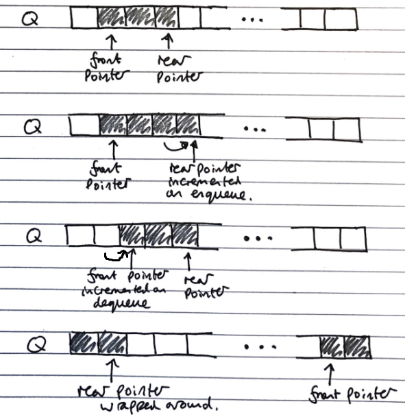

## Stacks (ADT)
> **Stacks** are a "Last in, first out" (LIFO) data structure, with both insertions and deletions always occurring at the front of the stack. 

These insertions and deletions are the fundamental operations of the stack, called pushing and popping respectively.

There is an edge case of popping from an empty stack, which normally either returns null or throws an error

Stacks have the fundamental operations:

- push(e)
- pop()
- size()
- isEmpty()

### Array Based Implementation

Index of head stored, and incremented/decremented on pushing/popping operations

- *O(n)* space complexity

- *O(1)* time complexity of fundamental operations

## Queues (ADT)

> **Queues** are a "First in, first out" (FIFO) data structure, with insertions occurring at the rear and removals at the front of the queue. 

These insertions and deletions are the fundamental operations of the stack, called enqueueing and dequeuing respectively.

There is an edge case of dequeuing from an empty queue, normally either returns null or throws an error

Queues have the fundamental operations

- enqueue(e)
- dequeue()
- size()
- isEmpty()

### Array Based Implementation

Uses and array with data wrapping (so like using an array in a `Queue` class with extra fields/properties) around as it is added and removed. Both the index of the head ***f*** **and** the size of the queue ***s*** need to be stored.

The rear of the queue (index to insert to next) is *(f + s)* mod *N*, with *N* as the array size

*Image source: Data Structures and Algorithms in Java, Goodrich, Tamassia, Goldwasser*

- *O(n)* space complexity
- *O(1)* time complexity of fundamental operations
