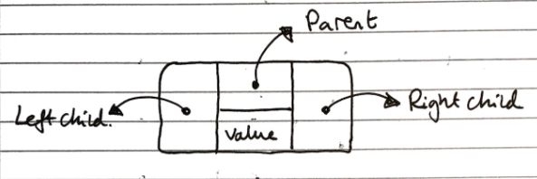

# Trees (ADT)
**Trees** are "an abstract model of a hierarchical structure" *Data Structures and Algorithms in Java*, Goodrich, Tamassia, Goldwasser


*If you want to pull request more stuff here, please do - but I'm not too sure how much more depth is needed*


They have the fundamental methods
- size()
- isEmpty()
- root()
- parent(n)
- children(n)
- numChildren(n)

The methods for insertion, deletion, and searching are more complicated, and so are outlined in more detail in the binary search tree section


# Tree traversals

There are various types of ways that a tree can be traversed

## Pre-order traversal

Each node is printed before its descendants, and descendants are taking in ascending order
```
Let n <- the root node of the graph

Function preOrder(n)
	Print n
	For each child m of n
		preOrder(n)
```

## Post-order traversal

Each node is printed after its descendants, and descendants are taking in ascending order
```
Let n <- the root node of the graph

Function preOrder(n)
	For each child m of n
		preOrder(n)
	Print n
```


# Binary trees (ADT)

**Binary trees** are a specialised tree where each node has at most two children, called left and right


## Properties

A binary tree with $$n$$ nodes, $$e$$ external nodes, $$i$$ internal nodes, and a height $$h$$ has the properties
- $$e = i + 1$$
- $$n = 2e - 1$$
- $$h \leq i$$
- $$h \leq \frac{(n-1)}{2}$$
- $$e \leq 2^h$$
- $$h \geq log_2 e$$
- $$h \geq log_2 (n+1) - 1$$


Binary trees support an additional type of traversal, **in-order**, as they have a discrete middle node

```
Let n <- the root node of the graph

Function preOrder(n)
	Print left child of n
	Print n
	Print right child of n
```


## Implementations

There are two common concrete implementations of binary trees

- Linked structure
- Array based


### Linked structure

In the linked structure implementation, each node is an object which stores its value, references to its child nodes (and sometimes a reference to its parent), as shown in the diagram below:

Image source: *Data Structures and Algorithms in Java*, Goodrich, Tamassia, Goldwasser

This has a linear space complexity irrespective of the balance of the tree, and has a lookup time of $$O(log_2n)$$ for lookup operations.


### Array based

In the array based implementation, node values are stored in an array, and their children can be found at indices based on arithmetic operations of their own index

- $$index(root) = 0$$

- If $$l$$ is the left child of $$n$$, then $$index(l) = 2 \cdot index(n) + 1$$
- If $$r$$ is the right child of $$n$$, then $$index(r) = 2 \cdot index(n) + 2$$


This can be very inefficient for unbalanced trees, for example, a tree which is just a "line" of nodes would grow with $$O(2^n)$$ space, but it has a similarly good lookup time of $$O(log_2n)$$ 