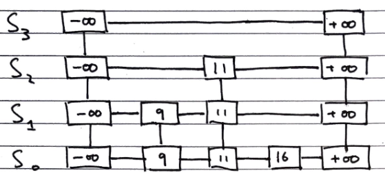
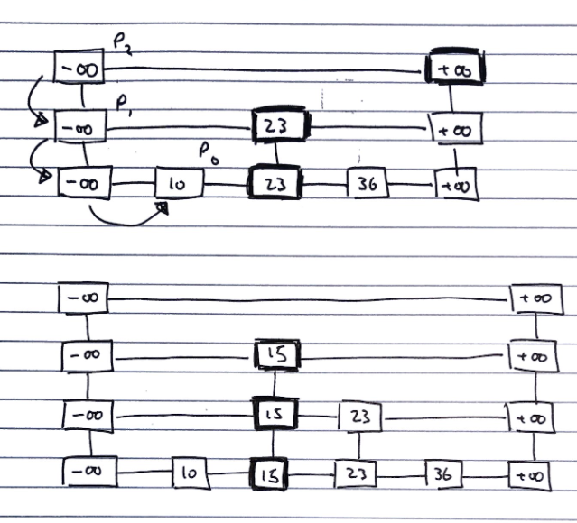
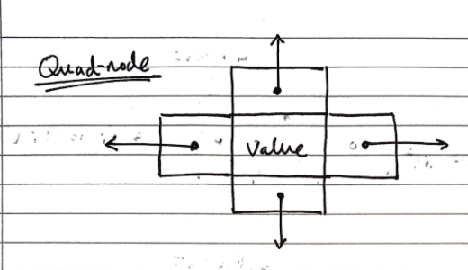

# Motivations for skip lists

We want to be able to efficiently implement  both searching, and insertion and deletion

For fast searching, we need the list to be sorted, and we have come across two concrete implementations of lists, but neither of which fulfil both of  these goals.

- Sorted arrays
  - Easy to search using binary search, since they are not indexable, needs $O(log\ n)$ time
  - Difficult insert/delete from, as elements need to be "shuffled up" to maintain ordering, needs $O(n)$ time
- Sorted lists
  - Easy to insert/delete from, assuming the position is known, needs $O(1)$ time
  - Difficult to search, since they are not indexable, needs $O(n)$ time


# Skip lists as an ADT

**Skip lists** are composed from a number of sub-lists, which act as layers within them, which we denote by the set $$S = \{S_0, S_1, ..., S_h\}$$ where $$h$$ denotes the number of layers in the list, i.e. its "height"

- All lists have a guard values $$+ \infty$$ and $$- \infty$$ at either end, and all the elements are in order between those values

- The "bottom" list, $$S_0$$ contains all the values in order between the guards

- The "top" list, $$S_h$$, contains only the guard values, $$+ \infty$$ and $$- \infty$$

- Each list $$S_i$$ for $$0 < i < h$$ (i.e. everything bar the top list, which contains only the guards, and the bottom list, which contains all elements) contains a random subset of the elements in the list below it, $$S_1$$

- The probability of an element in $$S_i$$ being in the list above it, $$S_{i+1}$$, is $$0.5$$

  

A diagram of the structure of a skip list is shown below


Image source: *Data Structures and Algorithms in Java*, Goodrich, Tamassia, Goldwasser


## Searching

To search for an value $$v$$ in a skip list, we follow the algorithm

```
Start at the first position in the top list (the top minus infinity guard)

Repeat
	//Scan forward step
	Repeat
		If the value of the right adjacent position is greater than that of the current position
			Break out of the loop
		Else if the value of the right adjacent position is equal to the current position
			Stop, since the element has been found
		Move to the right adjacent position
		
	//Drop down step
	If there is a below adjacent position (you're not in the bottom list)
		Move to the below adjacent position
	Else (you're in the bottom list)
		Stop, since the element is not in the list
```


Image source: *Data Structures and Algorithms in Java*, Goodrich, Tamassia, Goldwasser

## Inserting

To insert a value $$v$$ into a skip list, we follow the algorithm

```
Let i <- the number of flips of a fair coin before a head comes up
If i >= h
	Add the new skip lists {S(h+1), ..., S(i+1)} to S, all by default only containing the guards
Find the positions p(1), ..., p(i) in all the the lists of the largest element less than v, using the search algorithm
For each j from 0 to i
	Insert k into S(j) immediately after the position p(j)
```


Image source: *Data Structures and Algorithms in Java*, Goodrich, Tamassia, Goldwasser


## Deleting

To delete a value $$v$$ from a skip list, we follow the algorithm

```
Find the positions p(1), ..., p(i) in all the the lists of the largest element less than v, using the search algorithm
Remove the postions  p(1), ..., p(i) from the lists S(0), ..., S(i)
Remove any duplicate list layers containing only guards from the top of the skip list
```


Image source: *Data Structures and Algorithms in Java*, Goodrich, Tamassia, Goldwasser


# Implementation

We can use "quad-nodes", which are similar to those used in linked lists, but with four pointers, instead of just one to store the entry, and links to the previous, next, below and above nodes:


Image source: *Data Structures and Algorithms in Java*, Goodrich, Tamassia, Goldwasser

Additionally, there are special guard nodes, with the values $$+ \infty$$ and $$- \infty$$, and fewer pointers, as they don't have adjacencies on one side


# Performance

## Space usage

Dependent on randomly generated numbers for how many elements are in high layers, and how high the layers are

We can find the expected number of node for a skip list of $$n$$ elements:

>The probability of having $$i$$ layers in the skip list is $$\frac{1}{2^i}$$
>
>The probability of having $$i$$ layers in the skip list is $$\frac{1}{2^i}$$
>
>If the probability of any one of $$n$$ entries being in a set is $$p$$, the expected size of the set is $$n \cdot p$$
>
>Hence, the expected size of a list $$S_i$$ is $$\frac{n}{2^i}$$
>
>This gives the expected number of elements in the list as $$\sum_{i=0}^{h}(\frac{n}{2^i})$$
>
>We can express this is $$n \cdot \sum_{i=0}^{h}(\frac{1}{2^i})$$, and with the sum converging to a constant factor, so the space complexity is $$O(n)$$


The height of a skip list of $$n$$ items is **likely** to (since it is generated randomly) have a height of order $$O(log\ n)$$

We show this by taking a height logarithmically related to the number of elements, and showing that the probability of the skip list having a height greater than that is very small

> The probability that a layer $$S_i$$ has at least one item is at most $$\frac{n}{2^i}$$
>
> Considering a layer logarithmically related to the number of elements $$i = 3 \cdot log\ n$$
>
> The probability of the layer $$S_i$$ has at least one entry is at most $$\frac{n}{2^{3 \cdot log\ n}} = \frac{n}{n^3} = \frac{1}{n^2}$$
>
> Hence, the probability of a skip list of $$n$$ items having a height of more than $$3 \cdot log\ n$$ is at most $$\frac{1}{n^2}$$, which tends to a negligibly small number very quickly


## Search time

The search time is dependent on the number of steps (both scan forward and drop down) that need to be taken to find or verify the absence of the item. We can find it as follows

> In the worst case, the both dimensions have to be totally traversed, if the item is both bigger than all other items, and not present
>
> The number of drop down steps is bounded by the height ($$\approx O(log\ n)$$ with high probability)
>
> The expected number of scan forward steps in each list is $$2$$, so the expected number of scan forward steps in total is $$O(log\ n)$$
>
> ​		**If you can word a better explanation of this, please pull request**
>
> Hence, the total search time is $$O(log\ n)$$


## Update time

Since the insert and delete operations are both essentially wrappers around the search operation, and all of their additional functionality is of $$O(log\ n)$$ or better, the time complexity is the same as the search function
