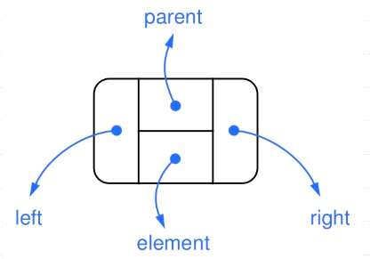

# Trees (ADT)
- "A tree is an abstract model of a hierarchical structure" *Data Structures and Algorithms in Java*, Goodrich, Tamassia, Goldwasser
- Fundamental methods
  - size(), isEmpty(), root(), parent(n), children(n), numChildren(n)
- Traversals
  - Pre-order traversal
    - Each node is printed before its descendants, and descendants are taking in ascending order
      ```
      Let n <- the root node of the graph
      
      Function preOrder(n)
      	Print n
      	For each child m of n
      		preOrder(n)
      ```
  - Post-order traversal
    - Each node is printed after its descendants, and descendants are taking in ascending order
      ```
      Let n <- the root node of the graph
      
      Function preOrder(n)
      	For each child m of n
      		preOrder(n)
      	Print n
      ```
      

## Binary trees (ADT)
- A specialised tree where each node has at most two children, called left and right
  - A binary search tree with $$n$$ nodes, $$e$$ external nodes, $$i$$ internal nodes, and a height $$h$$ has the properties
    - $$e = i + 1$$
    - $$n = 2e - 1$$
    - $$h \leq i$$
    - $$h \leq \frac{(n-1)}{2}$$
    - $$e \leq 2^h$$
    - $$h \geq log_2 e$$
    - $$h \geq log_2 (n+1) - 1$$
  - Binary trees support an additional type of traversal, in-order, as they have a discrete middle node
    ```
    Let n <- the root node of the graph
    
    Function preOrder(n)
    	Print left child of n
    	Print n
    	Print right child of n
    ```
- Linked structure implementation **(Concrete)**
  - Each node is an object which stores its value, references to its child nodes (and sometimes a reference to its parent)
  - A diagram of such an implementation for a binary tree
    
    Image source: *Data Structures and Algorithms in Java*, Goodrich, Tamassia, Goldwasser
  - This is a linear space implementation, and has lookup time of $$O(log_2n)$$ for binary trees, and logarithmic time for general trees

- Array based implementation of *binary* trees **(Concrete)**
  - Node values are stored in an array, and their children can be found at indices based on arithmetic operations of their own index
    - $$index(root) = 0$$
    - If $$l$$ is the left child of $$n$$, then $$index(l) = 2 \cdot index(n) + 1$$
    - If $$r$$ is the right child of $$n$$, then $$index(r) = 2 \cdot index(n) + 2$$
  - This can be very inefficient for unbalanced trees, for example, a tree which is just a "line" of nodes would grow with $$O(2^n)$$ space, and has lookup time of $$O(log_2n)$$ 
